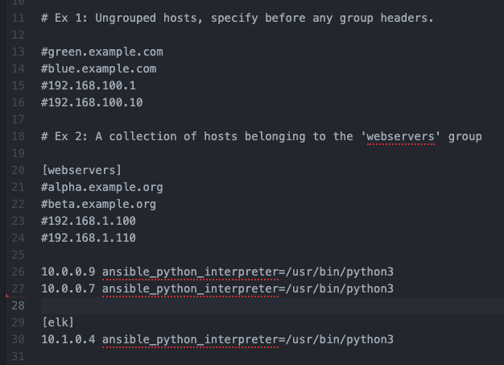
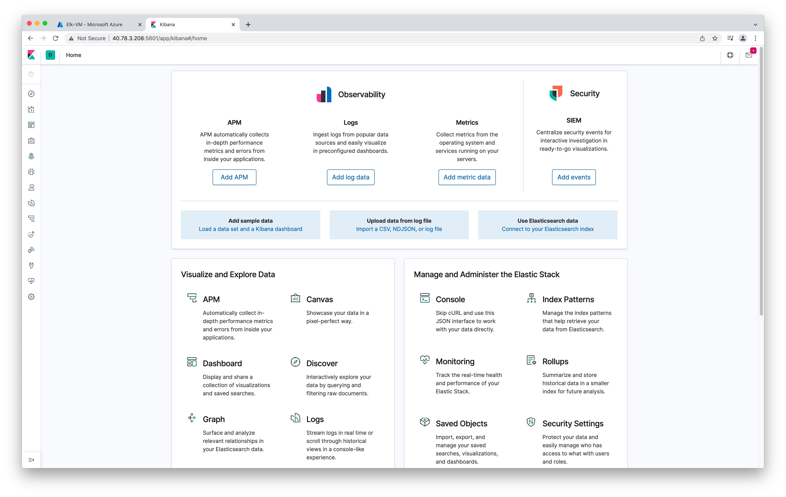
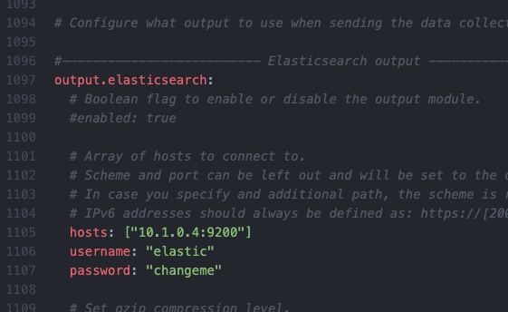
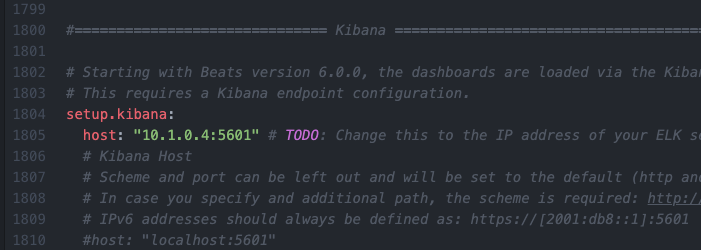
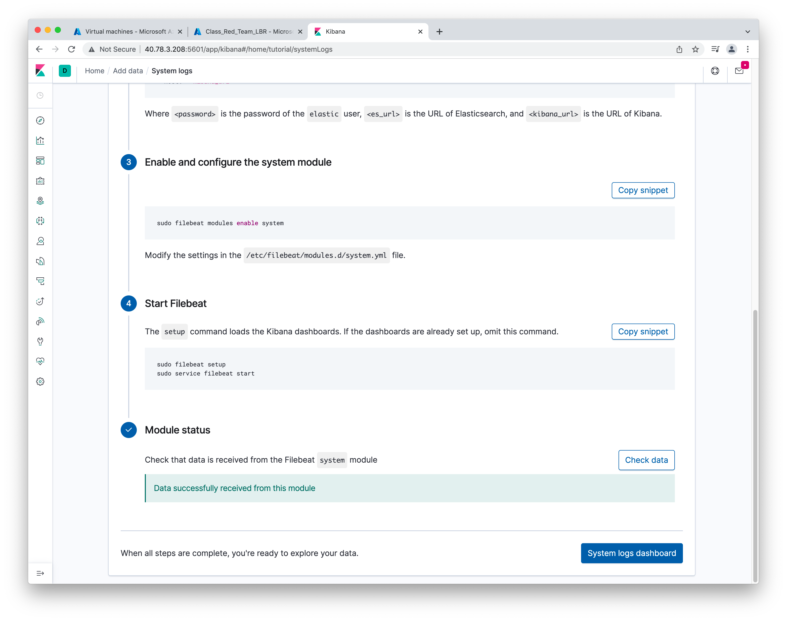
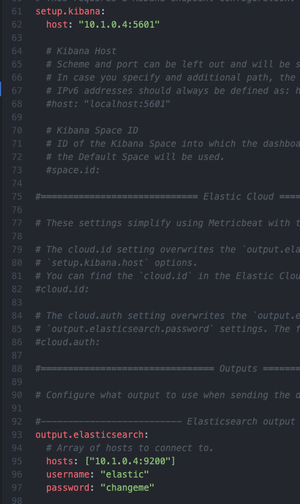
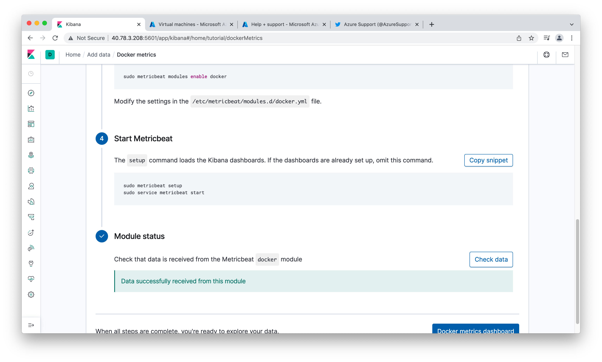

## Automated ELK Stack Deployment

The files in this repository were used to configure the network depicted below.

These files have been tested and used to generate a live ELK deployment on Azure. They can be used to either recreate the entire deployment pictured above. Alternatively, select portions of the __playbook (.yml)__ file may be used to install only certain pieces of it, such as Filebeat.

  - _Listed below are the playbook files_  
       [Install DVWA & Docker to Webservers](ansible/my-playbook.yml)    
       [Install Elk to Elkserver](ansible/install-elk.yml)  
       [Install Filebeat on Elk VM](ansible/filebeat-playbook.yml)  
       [Install Metricbeat on Elk VM](ansible/metricbeat-playbook.yml)  
 - _Listed below are the configuration files_  
       [Filebeat Config](ansible/filebeat-config.yml)  
       [Metricbeat Config](ansible/metricbeat-config.yml)  
       [Hosts](ansible/hosts)  

This document contains the following details:
- Description of the Topology
- Access Policies
- ELK Configuration
  - Beats in Use
  - Machines Being Monitored
- How to Use the Ansible Build

### Description of the Topology

The main purpose of this network is to expose a load-balanced and monitored instance of DVWA, the D*mn Vulnerable Web Application.

Load balancing ensures that the application will be highly __available__, in addition to restricting __access__ to the network.  

Security aspect of load balancers  
  - _Load balancer balances the load between various VMs, thus making application highly available and protecting the "Availability" aspect of CIA security triage_  

Advantage of a Jump box  
  - _Jump Box restricts the access to the virtual machines and allowing only remote connection through one VM (which is Jump Box) and certain type of traffic (SSH). hence securing the virtual machines/network or reducing the vulnerabiliy_

Integrating an ELK server allows users to easily monitor the vulnerable VMs for changes to the __available__ and system __logs__.  

What does Filebeat watch for?  
- _Filebeat is a lightweight shipper for forwarding and centralizing log data. Installed as an agent on the servers, Filebeat monitors the log files or specified locations, collect log events, and forwards them either to Elasticsearch or Logstash for indexing_  

What does Metricbeat record?  
- _Metricbeat takes the metrics and statistics that it collects and ships them to the specified output, such as Elasticsearch or Logstash. It monitor/record metrics from the system and services running on the server, such as: Apache_

The configuration details of each machine may be found below.

| Name     	| Function 	| IP Address Public Private 	| Operating System   	|
|----------	|----------	|---------------------------	|--------------------	|
| Jump Box 	| Gateway  	| 23.99.206.222 10.0.0.8    	| Linux Ubuntu 20.04 	|
| Web-1    	| DVWA     	| 40.122.186.242 10.0.0.9   	| Linux Ubuntu 20.04 	|
| Web-2    	| DVWA     	| 40.122.186.242 10.0.0.7   	| Linux Ubuntu 20.04 	|
| Elk-VM   	| ELK      	| 40.78.3.208 10.1.0.4      	| Linux Ubuntu 20.04 	|

### Access Policies

The machines on the internal network are not exposed to the public Internet.

Only the __Jump Box Provisioner__ machine can accept connections from the Internet. Access to this machine is only allowed from the following IP addresses:

- _My Home machine IP Address 98.200.158.197 is the only whiltelisted IP address which can connect to the Jump Box Provisioner via an Inbound Security Rule created under Class_Red_Team_NES Network Security Group._

Machines within the network can only be accessed by __Jump Box Provisioner__.

- _My Home machine IP Address 98.200.158.197 is the only whitelisted IP address which can connect to the Elk VM via an Inbound Security Rule created under Elk-VM-nsg Network Security Group._

A summary of the access policies in place can be found in the table below.

| Name     	| Publicly Accessible 	| Allowed IP Addresses               	|
|----------	|---------------------	|------------------------------------	|
| Jump Box 	| Yes                 	| My Home Machine IP  98.200.158.197 	|
| Web-1    	| No                  	| 10.0.0.9                           	|
| Web-2    	| No                  	| 10.0.0.7                           	|
| Elk-VM   	| Yes                 	| My Home Machine IP  98.200.158.197 	|

### Elk Configuration

Ansible was used to automate configuration of the ELK machine. No configuration was performed manually, which is advantageous because...  

Main advantage of automating configuration with Ansible:
- _Ansible automates creation, configuration and management of machines, hence provides consistent, repeatable and predictable configuration. Instead of manually keeping servers updated, making configuration files. moving files, etc., Ansible automate this for group of servers from one control machine. This makes the deployment secure. The Elk stack can be created and configured very quickly using Ansible._

The playbook implements the following tasks:
- _Install docker.io and python3-pip packages using apt module._
- _Install docker python using pip module._
- _Configure virtual memory using sysctl module and maximum mapped count of 262144._
- _Download and launch docker Elk container using sebp/elk 761 image; publish ports 5601, 9200 & 5044._
- _Enable docker service on boot using systemd module._

The following screenshot displays the result of running `docker ps` after successfully configuring the ELK instance.

### Target Machines & Beats
This ELK server is configured to monitor the following machines:
- _Web-1 - 10.0.0.9_
- _Web-2 - 10.0.0.7_

We have installed the following Beats on these machines:
- _Filebeat_
- _Metricbeat_

These Beats allow us to collect the following information from each machine:
- _TODO: In 1-2 sentences, explain what kind of data each beat collects, and provide 1 example of what you expect to see. E.g., `Winlogbeat` collects Windows logs, which we use to track user logon events, etc._
- _Filebeat collects the system logs from the Web-1 & Web-2 VMs and forward those to the Elk VM in an easy to read format._
- _Metricbeat records metrics/statistics for system and services running on the Web-1 and Web-2 VMs and forward those to the Elk VM._

### Using the Playbook
In order to use the playbook, you will need to have an Ansible control node already configured. Assuming you have such a control node provisioned:

SSH into the control node and follow the steps below:
- Copy the __install-elk.yml__ file to __/etc/ansible/install-elk.yml__.
- Update the __/etc/ansible/hosts__ file to include...
- Run the playbook, and navigate to __http://[your.elk.ip]:5601/app/kibana__ to check that the installation worked as expected.

Playbook Information:  
- _Playbook file is install-elk.yml (refer Intall Elk to Elk Server under the playbook files provided above) and the file is placed under /etc/ansible folder inside the control node (Jump Box Provisioner). This playbook is used to configure the Elk VM_  

Configuration Files Information:  
- _The file that needs to be updated is /etc/ansible/hosts to include the internal IP addresses of the VM's where a specific container needs to be installed. For this project, we added Elk VM's internal IP to the hosts file (refer hosts file under the configuration files provided above), as shown below. Hosts file has two sections one for webservers and second for Elk server which ensure containers are deployed on the defined IPs only_  

      

URL to check that the ELK server is running:    
- _http://[40.78.3.208]:5601/app/kibana._    
  

_As a **Bonus**, provide the specific commands the user will need to run to download the playbook, update the files, etc._
Listed below are the bash commands to run the playbooks  
    - ssh azadmin@JumpBoxProvisioner Public IP (23.99.206.222)  
    - sudo docker container list -a (locate your ansible container - mine is suspicious_jang)  
    - sudo docker start container (name of the container - suspicious jang)   
    - sudo docker attach container (name of the container - suspicious jang)  
- _After the successful execution of above commands, you will have root access for the Ansible container inside the Jump Box. Follow the commands below to execute the playbooks (Filebeat and Metricbeat)._     
    - Go to /etc/ansible location  
    - Move the Install Elk to Elk server file provided above under the /etc/ansible folder
    - ansible-playbook install-elk.yml (This will install the playbook on Elk VM)  
    
    - Download the Filebeat using the curl command  
         - curl  > /etc/ansible/filebeat-config.yml
    - Move the Filebeat Install on Elk VM file provided above to /etc/amsible/roles folder (if roles folder doesn't exist, create one)   
    - Change the Elk VM internal IP inside the filebeat.config.yml file, refer to the Filebeat Config file provided above and the screenshots below  
       
       
    - Go to /etc/ansible/roles folder and run the playbook using the command ansible-playbook <filename of the playbook> (in this case, its filebeat-playbook.yml). Successful execution of the playbook will produce the Kibana system log screenshot shown below  
      

    - Download the Metricbeat using the curl command  
         - curl  > /etc/ansible/metricbeat-config.yml
    - Move the Metricbeat Install on Elk file provided above to /etc/ansible folder
    - Change the Elk VM internal IP inside the metricbeat.config.yml file, refer to the Metricbeat Config file provided above
       
    - Go to /etc/ansible folder and run the playbook using the command ansible-playbook <filename of the playbook> (in this case, its metricbeat-playbook.yml). Successful execution of the playbook will produce the Kibana Metricbeat module stats as shown in screenshot below   
      
