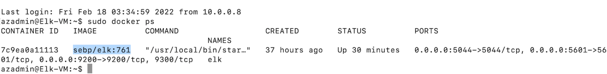

## Automated ELK Stack Deployment

The files in this repository were used to configure the network depicted below.

These files have been tested and used to generate a live ELK deployment on Azure. They can be used to either recreate the entire deployment pictured above. Alternatively, select portions of the __playbook (.yml)__ file may be used to install only certain pieces of it, such as Filebeat.

  - _Listed below are the playbook files_  
       [Install DVWA & Docker to Webservers](ansible/my-playbook.yml)..  
       [Install Elk to Elkserver](ansible/install-elk.yml)..
       [Install Filebeat on Elk VM](ansible/filebeat-playbook.yml)..
       [Install Metricbeat on Elk VM](ansible/metricbeat-playbook.yml)..
 - _Listed below are the configuration files_
       [Filebeat Config](ansible/filebeat-config.yml)..
       [Metricbeat Config](ansible/metricbeat-config.yml)..
       [Hosts](ansible/hosts)..

This document contains the following details:
- Description of the Topology
- Access Policies
- ELK Configuration
  - Beats in Use
  - Machines Being Monitored
- How to Use the Ansible Build

### Description of the Topology

The main purpose of this network is to expose a load-balanced and monitored instance of DVWA, the D*mn Vulnerable Web Application.

Load balancing ensures that the application will be highly __available__, in addition to restricting __access__ to the network.
- _TODO: What aspect of security do load balancers protect? What is the advantage of a jump box?_
- _Load balancer balances the load between various VMs, thus making application highly available and protecting the "Availability" aspect of CIA security triage_
- _Jump Box restricts the access to the virtual machines and allowing only remote connection through one VM (which is Jump Box) and certain type of traffic (SSH). hence securing the virtual machines/network or reducing the vulnerabiliy_

Integrating an ELK server allows users to easily monitor the vulnerable VMs for changes to the __available__ and system __logs__.
- _TODO: What does Filebeat watch for?_
- _Filebeat is a lightweight shipper for forwarding and centralizing log data. Installed as an agent on the servers, Filebeat monitors the log files or specified locations, collect log events, and forwards them either to Elasticsearch or Logstash for indexing_
- _TODO: What does Metricbeat record?_
- _Metricbeat takes the metrics and statistics that it collects and ships them to the specified output, such as Elasticsearch or Logstash. It monitor/record metrics from the system and services running on the server, such as: Apache_

The configuration details of each machine may be found below.
_Note: Use the [Markdown Table Generator](http://www.tablesgenerator.com/markdown_tables) to add/remove values from the table_.

| Name     	| Function 	| IP Address Public Private 	| Operating System   	|
|----------	|----------	|---------------------------	|--------------------	|
| Jump Box 	| Gateway  	| 23.99.2.6.222 10.0.0.8    	| Linux Ubuntu 20.04 	|
| Web-1    	| DVWA     	| 40.122.186.242 10.0.0.9   	| Linux Ubuntu 20.04 	|
| Web-2    	| DVWA     	| 40.122.186.242 10.0.0.7   	| Linux Ubuntu 20.04 	|
| Elk-VM   	| ELK      	| 40.78.3.208 10.1.0.4      	| Linux Ubuntu 20.04 	|

### Access Policies

The machines on the internal network are not exposed to the public Internet.

Only the __Jump Box Provisioner__ machine can accept connections from the Internet. Access to this machine is only allowed from the following IP addresses:
- _TODO: Add whitelisted IP addresses_
- _My Home machine IP Address 98.200.158.197 is the only whiltelisted IP address which can connect to the Jump Box Provisioner via an Inbound Security Rule created under Class_Red_Team_NES Network Security Group._

Machines within the network can only be accessed by __Jump Box Provisioner__.
- _TODO: Which machine did you allow to access your ELK VM? What was its IP address?_
- _My Home machine IP Address 98.200.158.197 is the only whitelisted IP address which can connect to the Elk VM via an Inbound Security Rule created under Elk-VM-nsg Network Security Group._

A summary of the access policies in place can be found in the table below.

| Name     	| Publicly Accessible 	| Allowed IP Addresses               	|
|----------	|---------------------	|------------------------------------	|
| Jump Box 	| Yes                 	| My Home Machine IP  98.200.158.197 	|
| Web-1    	| No                  	| 10.0.0.9                           	|
| Web-2    	| No                  	| 10.0.0.7                           	|
| Elk-VM   	| Yes                 	| My Home Machine IP  98.200.158.197 	|

### Elk Configuration

Ansible was used to automate configuration of the ELK machine. No configuration was performed manually, which is advantageous because...
- _TODO: What is the main advantage of automating configuration with Ansible?_
- _Ansible automates creation, configuration and management of machines, hence provides consistent, repeatable and predictable configuration. Instead of manually keeping servers updated, making configuration files. moving files, etc., Ansible automate this for group of servers from one control machine. This makes the deployment secure. The Elk stack can be created and configured very quickly using Ansible._

The playbook implements the following tasks:
- _TODO: In 3-5 bullets, explain the steps of the ELK installation play. E.g., install Docker; download image; etc._
- _Install docker.io and python3-pip packages using apt module._
- _Install docker python using pip module._
- _Configure virtual memory using sysctl module and maximum mapped count of 262144._
- _Download and launch docker Elk container using sebp/elk 761 image; publish ports 5601, 9200 & 5044._
- _Enable docker service on boot using systemd module._

The following screenshot displays the result of running `docker ps` after successfully configuring the ELK instance.

### Target Machines & Beats
This ELK server is configured to monitor the following machines:
- _TODO: List the IP addresses of the machines you are monitoring_
- _Web-1 - 10.0.0.9_
- _Web-2 - 10.0.0.7_

We have installed the following Beats on these machines:
- _TODO: Specify which Beats you successfully installed_
- _Filebeat & Metricbeat_

These Beats allow us to collect the following information from each machine:
- _TODO: In 1-2 sentences, explain what kind of data each beat collects, and provide 1 example of what you expect to see. E.g., `Winlogbeat` collects Windows logs, which we use to track user logon events, etc._
- _Filebeat collects the system logs from the Web-1 & Web-2 VMs and forward those to the Elk VM in an easy to read format._
- _Metricbeat records metrics/statistics for system and services running on the Web-1 and Web-2 VMs and forward those to the Elk VM._

### Using the Playbook
In order to use the playbook, you will need to have an Ansible control node already configured. Assuming you have such a control node provisioned:

SSH into the control node and follow the steps below:
- Copy the __install-elk.yml___ file to __/etc/ansible/install-elk.yml___.
- Update the __/etc/ansible/hosts___ file to include...
- Run the playbook, and navigate to __http://[your.elk.ip]:5601/app/kibana__ to check that the installation worked as expected.

_TODO: Answer the following questions to fill in the blanks:_
- _Which file is the playbook? Where do you copy it?_
- _Playbook is install-elk.yml and the file is placed under /etc/ansible folder inside the control node._
- _Which file do you update to make Ansible run the playbook on a specific machine? How do I specify which machine to install the ELK server on versus which to install Filebeat on?_
- _The file that needs to be updated is /etc/amsible/hosts to include the internal IP addresses of the VM's where a specific container needs to be installed. For this project, we added Elk VM's internal IP to the hosts file, as shown below._

- _Which URL do you navigate to in order to check that the ELK server is running?_
- _http://[40.78.3.208]:5601/app/kibana._

_As a **Bonus**, provide the specific commands the user will need to run to download the playbook, update the files, etc._
